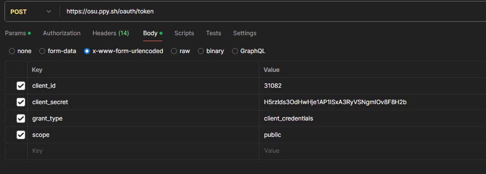

---

### Sorbonne Université - Master STL

### MU4IN507 - PC3R

Année 2023-2024

---

## Rapport - Projet Web

### Osu!BeatAdvisor

    

 Alex XU & Antoine LUONG

   

# Osu! - BeatAdvisor

Le site web *Osu! - BeatAdvidor* vous permet de générer des playlists basées sur vos préferences ! 
Il contient une composante sociale, vous permettant de partager vos playslists favorites, de commenter celles des autres et de les liker.
**Lien direct vers le site web:** http://13.38.13.216:8080/

# API Web : osu!web

Accès à l'API ici : https://osu.ppy.sh/docs/index.html#
**Important:** les requêtes vers l'API Osu! requiert un token qui peut être récupéré via une autre requête vers l'API. Notre système s'occupe de faire cette requête pour pouvoir automatiser l'appel à l'API pour récupérer les beatmaps.

*Contextualisation : osu! est un jeu de rythme, dans lequel les joueurs lancent des stages qu'on appelle "beatmap" dont le but est d'obtenir le meilleur score possible*

Les beatmaps sont composées par les joueurs, ainsi les données de l'API sont régulièrement mis à jour.

L'APi propose des requêtes get sur :
- les beatmaps (Get Beatmaps, Get a User Beatmap score, Get Beatmap scores, etc...)
- les joueurs (Get User, Get User Scores, Get User Beatmaps, etc...)

Les informations des beatmaps que nous utiliserons pour créer des playlists concerneront principalement :
- le mode (osu, mania, taiko, fruits)
- la difficulté 
- les tags
- le genre
- la langue
- le status (ranked, graveyard, WIP, qualified)
- la durée

### Pourquoi ce site?

Le site officiel de Osu! possède bien une zone de recherche pour des beatmaps spécifiques, mais il faudrait chercher les beatmaps un par un. Au lieu de rechercher manuellement chaque beatmap, notre API  permet de générer automatiquement des playlists de plusieurs beatmaps en fonction des préférences et des intérêts des utilisateurs.

# Fonctionnalités

- Les utilisateurs doivent créer un compte et se connecter pour accéder aux fonctionnalités du site. Ils peuvent à tout moment se déconnecter et supprimer leur compte. A la connexion, un cookie de session sera enregistré, et expira après 1 heure.
- Les utilisateurs pourront filtrer selon le genre musical, le niveau de difficulté des chansons, les artistes préférés et plus encore pour la génération de la playlist.
- La génération tirera aléatoirement les beatmaps dont les préférences correspondent. 
- De nouvelles beatmaps seront ajoutées au site web, on récupère les nouvelles beatmaps que les joueurs créent sur le site officiel.
- Les utilisateurs peuvent modifier le titre, les tags, les langues et les genres de leurs playlists, ils peuvent également supprimer des beatmaps de leur playlist.
- Les utilisateurs pourront partager, commenter, liker les playlists.
- Les utilisateurs peuvent suivre/ne plus suivre d'autres utilisateurs, ils seront notifiés lorsque le suivi modifie/crée des playlists

# Cas d'utilisation 

- **Création de playlist:** L'utilisateur se connecte, il attérit sur la page d'accueil dans laquelle il peut générer une playlist en spécifiant ses préférences, en cochant les filtres proposés ou bien en ajoutant des tags. Le site pioche ensuite x beatmaps correspondant aux préférences de l'utilisateur, et propose la playlist à l'utilisateur.
- **Création d'une nouvelle playlist:** Après la génération d'une playlist, l'utilisateur peut refuser la playlist et demander d'en générer une autre et peut sélectionner les maps à garder lors de la nouvelle génération.
- **Editer une playlist:** L'utilisateur se connecte, et se retrouve dans la page d'accueil. Il va dans sa page de playlist et en clique sur une. Il peut manuellement retirer des beatmaps, éditer son titre, les tags, les genres ou les langues. Il clique sur éditer, et écrit dans la barre du titre un autre titre puis clique sur accepter. La playlist possède maintenant un nouveau titre.
- **Voir toutes les playlists:** L'utilisateur se connecte, et se retrouve dans la page d'accueil. Il clique sur un bouton "En ce moment" et peut observer toutes les playlists du site qui ont été créées.
- **Commenter une playlist:** L'utilisateur se connecte, et clique sur une des playlists de l'onglet "En ce moment". Il clique sur un bouton "commenter" et écrit un commentaire sur une zone de texte puis clique sur un bouton "post". La playlist possède un nouveau commentaire visible pour les utilisateurs.
- **Suivre une playlist:** L'utilisateur se connecte, et clique sur une des playlists de l'onglet "En ce moment". Il clique sur le bouton suivre. Il va dans sa page de playlists et la playlist suivie apparaît. Il ne peut cependant pas la modifier.
- **Supprimer une playlist:** L'utilisateur se connecte, et se retrouve dans la page d'accueil. Il va sur sa page de playlists et en clique sur une. Il clique sur un bouton "supprimer" à côté du nom de la playlist, une fenêtre de confirmation apparaît et il clique sur "continuer". Il retourne dans sa page de playlist mise à jour avec la playlist supprimée.
- **Supprimer une beatmap d'une playlist:** L'utilisateur se connecte et se retrouve dans la page d'accueil. Il va dans sa page de playlists et en clique sur une. Il clique sur éditer et sur une croix à côté d'une des beatmaps affichées. Il retourne dans la page d'édition avec la beatmap supprimée, et les détails de la playlist (genres, langues, etc) mises à jour.
- **Ajouter un ami:** L'utilisateur se connecte et se retrouve dans la page d'accueil. Il clique sur le bouton pour voir toutes les playlists et en clique sur une. Il voit les détails de la playlist dont l'auteur. Il clique sur l'auteur, les détails de celui-ci apparaît et il clique sur un bouton "suivre". L'utilisateur suit maintenant l'auteur et recevra des nouvelles des playlists ajoutées/modifiées.
- **Supprimer un ami:** L'utilisateur se connecte et se retrouve dans la page d'accueil. Il va sur son profil et clique sur ses amis. Une page avec une liste de ses amis apparait, il clique sur un des amis et sa page de profil apparaît. Il clique sur un bouton "ne plus suivre". Il revient sur sa page de profil et clique sur "Amis", il ne voit plus l'utilisateur dans sa liste d'amis.

# Données 

## User

| id_user | email                              | pseudo | password | playlists | friends |
| ------- | ---------------------------------- | ------ | -------- | --------- | ------- |
| 0       | alex.xu@etu.sorobnne-universite.fr | Alex   | "4Fd8Gh" | [0, 1 ]   | [0,1,2] |

## Playlist

| id_playlist |   title   |  url  | length| mode     | genres      | languages                | tags              | difficulty | Beatmaps |
| ----------- | --------- | ----- |------ | -------- | ----------- | ------------------------ | ----------------- | ------------ | ------------- |
| 0           |  salle    | url1  |50     | all      | [Jeu vidéo] | [Instumental]            | [pokemon, ..]     | 1.02 - 3.13  | [Granat, ..]
| 1           |   ewweeb     | url2  |20     | fruits   | [Anime]     | [Japanese, Instrumental] | [dragon ball, ..] | 2.11 - 4.51  | [Dragon Ball Z Opening Theme, ..]
| 2           |  rock'n'roll   | url3  |10     | mania    | [Rock]      | [English]                | [pink floyd, ..]  | 1.51 - 5.34  | [Symphony of the dark, ..] 

On peut cliquer sur le titre qui amène vers la playlist. Dans la playlist, le nom des beatmaps sont directement des liens vers le site officiel de Osu!.

## Comment

| id | author     | text | date |
| ------- | ------------ | ------ | -------- |
| 0 | Alex | yoo les gars c'est Alex | 26-06-2024 |

## Beatmap de l'API externe vers la base de données

| id | difficulty rating (float) | mode | status | length | author id | Url | Beatmapset |
| ------- | ------------| ------ | -------- | ----- | ----- | ------ | ------ |
| 152 | 3.75 | osu | ranked | 193 | 88 | "https://osu.ppy.sh/beatmaps/152" | [voir en dessous] |

Beatmapset:

| title | genre | language | tags | ranked date | submitted date |
| ------- | ------------| ------ | -------- | ----- | ----- |
| "What I've Done" | "" | "" | "" |2007-10-08T18:35:23Z | 2007-10-08T18:35:23Z |

# Mise à jour des données et appel à l'API externe

Les données sont mises à jour en temps réel lorsqu'un utilisateur crée une nouvelle playlist ou modifie ses préférences. L'API externe est appelée pour alimenter la base de données mettant à jour toutes les beatmaps du site. Des millions de beatmaps sont disponibles sur le site officiel, notre API s'en charge pour tous les récupérées. Les genres et langages sont complétés dans nos structures de beatmaps en suivant les tags de la beatmap, donc si le créateur de la beatmap n'a pas mis de tags, alors le genre et langage ne seront pas complétés automatiquement s'il ne les a pas complété lui-même.

L'API externe requiert une authentification avant de pouvoir l'utiliser, on doit récupérer un token d'identification avec la requête **POST /oauth/token**. 

Avec ce token, nous utilisons la requête **GET /beatmaps** de l'API externe pour récupérer une beatmap par son id. 

La requête permet de récupérer directement jusqu'à 50 beatmaps par requête, on peut donc faire en parallèle une goroutine qui exécute cette requête après x secondes.

# Description du Serveur

Le site utilise GO avec le package net/http, avec une approche basée sur des ressources (REACT), avec un ensemble de services RESTful pour gérer les utilisateurs, les playlists, et les interactions avec l'API d'Osu!. Chaque service est conçu pour gérer un aspect spécifique de l'application, comme la création de playlists, la gestion des utilisateurs, et tout ce qui concerne le social.

## Ressources et Fonctionnalités Associées

Dans la plupart des cas, l'utilisateur doit se connecter avant de pouvoir effectuer une requête.

- **Authentification (/user)**:
  
    - POST /api/user/login: Permet à un utilisateur de se connecter en envoyant son identifiant (pseudo ou email) et mot de passe.
    - POST /api/user/logout: Permet à un utilisateur de se déconnecter.
    - PUT /api/user/register: Permet à un nouvel utilisateur de s'inscrire en fournissant les informations nécessaires.

- **Utilisateurs (/user)**:

    - GET /api/user/{id}: Récupère les informations d'un utilisateur spécifique.
    - DELETE /api/user/delete/{id}: Supprime un utilisateur.

- **Playlists (/playlist)**:

    - GET /api/playlist/{id}: Récupère une playlist spécifique.
    - GET /api/playlist/get/{id_user}: Récupère toutes les playlists d'un utilisateur.
    - POST /api/playlist/create: Génère une nouvelle playlist basée sur les préférences de l'utilisateur, celui-ci peut filtrer la requête pour avoir des beatmaps dont il souhaite. Certaines informations comme la taille de la playlist seront complétées automatiquement.
    - PUT /api/playlist/edit/{id}: Met à jour une playlist (changer le titre, les tags etc.), seul l'auteur peut le faire.
    - DELETE /api/playlist/delete/{id}: Supprime une playlist, seul l'auteur de la playlist peut le faire.
    - POST /api/playlist/add: Ajoute une playlist pour un utilisateur, celui-ci ne pourra cependant pas la modifier car il n'est pas l'auteur de celle-ci, mais il pourra y accéder directement dans sa page de playlists. Requiert l'id de la playlist et de l'utilisateur dans le body.
    - DELETE /api/playlist/delete/beatmap: Supprime une beatmap d'une playlist, seul l'auteur peut le faire. Requiert l'id de la playlist et de la beatmap à supprimer dans le body.
    - GET /api/playlist/get/all: Récupère toutes les playlists du site.

- **Social**:

    - **Commentaires (/playlist/comment)**:

        - POST /api/playlist/comment/{id}: Ajoute un commentaire à une playlist.
        - DELETE /api/playlist/comment/delete/{playlist_id}/{comment_id}: Supprime un commentaire.

    - **Likes (/playlist/like)**:

        - POST /api/playlist/like/{id}: Ajoute un like à une playlist. Ici, un utilisateur ne peut liker une playlist qu'une seule fois.
        - DELETE /api/playlist/like/delete/{id}: Supprime un like d'une playlist.
    
    - **Share (/playlist/share)**:
        
        - GET /api/playlist/share/{id}: Renvoie l'URL de la playlist.
    
    - **User (/user)**:

        - PUT /api/user/edit: Editer son profil, on peut modifier son pseudo, son mot de passe (avec confirmation), sa date de naissance, sa description et sa ville. Les champs manquants ne seront pas modifiés et resteront intacts.
        - POST /api/user/friends: Ajoute l'utilisateur comme un ami (follow). Requiert l'id de l'utilisateur dans le body.
        - GET /api/user/friends/{id}: Retourne la liste d'amis de l'utilisateur.
        - DELETE /api/user/friends/delete/{id}: Supprime un ami.

- **Beatmaps (api osu!)**:

    - GET /beatmaps/{id}&{id}...: Récupère jusqu'à 50 beatmaps depuis l'API externe osu!web, les beatmaps récupérées seront mise à jour sur notre site pour compléter les genres/langues... manquants en regardant les tags. Chaque requête alimente notre base de données de 50 beatmaps à chaque appel.

# Description du Client

Le site est conçu avec React.js pour offrir une expérience utilisateur fluide. Les écrans incluent une page d'accueil, une interface de création de playlists, une page de découverte, et une section communauté. Les appels au serveur sont effectués à partir de ces différentes sections pour récupérer ou envoyer des données.

## Plan du Site et Contenu des Écrans

- **Page de connexion**:
    - Formulaire de connexion avec champs pour l'identifiant et le mot de passe avec bouton pour se connecter.
    - Lien vers la page d'inscription pour les nouveaux utilisateurs qui n'ont pas encore de compte.
    - Lien vers la récupération de mot de passe pour les utilisateurs qui ont oublié leur mot de passe.
    
- **Page d'Accueil**:
    - Génération de playlists basée sur des filtres spécifiés par l'utilisateur.
    - Affichage des playlists générées avec options pour sauvegarder, partager, et commenter.

- **Page de Playlist**:
    - Détails de la playlist sélectionnée avec liste des beatmaps, possibilité de modifier la playlist (ajouter/enlever des beatmaps, changer l'ordre, etc).

- **Profil Utilisateur**:
    - Affichage des informations de l'utilisateur, liste de ses playlists, et historique des commentaires.

# Requêtes et Réponses

## Authentification

| Nom du web service | URL du web service | Description du service | Paramètres en entrée | Format de sortie | Exemple de sortie | Erreurs possibles | Avancement | Fichiers GO | Informations additionnelles |
|--------------------|--------------------|------------------------|----------------------|------------------|-------------------|-------------------|-----------------------|---------------------|-------------------------|
| Register           | /user/register avec PUT | Permet à un nouvel utilisateur de s'inscrire en fournissant un email, un pseudo et un mot de passe | email, pseudo, mot de passe | JSON | - {"status": 200, "message": "Utilisateur inscrit avec succès", "detail": "inscription réussie pour pseudo"};  - {"status": 400, "message": "Champs manquants", "detail": "les champs email, pseudo et password sont nécessaires"};  - {"status": 400, "message": "Email invalide", "detail": "l'email doit contenir @ et finir par .com/.fr/..."};  - {"status": 409, "message": "Utilisateur existant", "detail": "l'utilisateur pseudo existe déjà ou email déjà utilisé"};  - {"status": 405, "message": "Méthode non supportée", "detail": "il faut une méthode PUT"};  - {"status": 500, "message": "Erreur interne", "detail": "erreur lors de l'insertion de l'utilisateur pseudo dans la base de données"}; | - Méthode non supportée (405)  - Données invalides ou incomplètes (400)  - Email invalide (400)  - Conflit utilisateur existant (409)  - Erreur interne lors de l'insertion dans la base de données (500) | Fini | /serveur/handlers/authentification.go | 1. Vérification de la méthode PUT.  2. Validation des champs requis (l'email doit être au bon format aussi).  3. Vérification de l'unicité de l'email et du pseudo.  4. Inscription de l'utilisateur dans la base de données.  5. Gestion des erreurs avec des messages appropriés.  6. Réponse JSON avec le résultat de l'opération. |
| Login              | /user/login/ avec POST | Permet de récupérer une clef de connexion valide pendant un certain temps (1 heure). | pseudo ou email; password | JSON | - {"status": 200, "message": "Connexion réussie", "userid": "6442546cd354647be214"};  - {"status": 400, "message": "Requête invalide: login et password nécessaires"};   - {"status": 401, "message": "Utilisateur inconnu"};   - {"status": 403, "message": "Login et/ou mot de passe invalide(s)"};   - {"status": 500, "message": "Erreur interne"};  | - Champs manquants (400)  - Utilisateur inconnu (401)  - Login et/ou mot de passe invalide(s) (403)  - Erreur interne (500) | Fini | /serveur/handlers/authentification.go | 1. Si tout se passe bien renvoyer le code 200 et Connexion réussie, et création de la session avec req.session.userid  2. Tous les champs doivent être complétés, si non -> 400  3. Vérification de l’existence du login, si non -> 401  4. Vérification du login et mot de passe, si non -> 403 |
| Logout | /user/logout avec POST | Permet à un utilisateur de se déconnecter en supprimant la session active associée au cookie de session. | Aucun (utilise le cookie de session) | JSON | - {"status": "200", "message": "Déconnexion réussie", "userId": "ID de l'utilisateur"}; | - Pas de cookie de session trouvé (401)  - Erreur interne du serveur (500, si le cookie de session ne peut pas être récupéré) | Fini | /serveur/handlers/authentification.go | 1. Suppression de la session du stockage des sessions.  2. Réinitialisation du cookie de session sur le navigateur de l'utilisateur pour le vider.  3. Réponse JSON confirmant la déconnexion de l'utilisateur. |

## Playlists

| Nom du web service | URL du web service | Description du service | Paramètres en entrée | Format de sortie | Exemple de sortie | Erreurs possibles | Avancement | Fichiers GO | Informations additionnelles |
|--------------------|--------------------|------------------------|----------------------|------------------|-------------------|-------------------|-----------------------|---------------------|-------------------------|
| Générer Playlist   | /playlist avec POST | Permet de générer une playlist | les préférences (genre, difficulté, tags, etc) | JSON | - {"status": 200, "message": "Playlist générée avec succès"};  - {"status": 500, "message": "Erreur interne"}; | - Utilisateur inconnu (401) | Fini | /serveur/handlers/playlists.go | 1. Si tout se passe bien renvoyer le code 200 et Playlist générée, et création de la playlist.  En général, c'est la fonction principale du site, elle s'occupe en plus de compléter certains détails de la playlist (taille par exemple) sans que l'utilisateur n'ait à le faire. |
| Récupérer une Playlist | /playlist/{id} avec GET | Permet de récupérer une Playlist | l'id de la Playlist | JSON, Tableau | - [{"date" : "17/04/2002", "auteur": "1d5s1s88d5f4s64f", "likes": 5, "commentaires": {"comm1: "}, "beatmaps" : {"beatmap1": "Symphony of the night"}, {beatmap2": ...}, {...}},  , ;  - {"status": 404, "message": Playlist pas trouvée  - {"status": 500, "message": "Erreur interne"}; | - Utilisateur inconnu (401)  - Playlist pas trouvée (404) | Fini | /serveur/handlers/playlists.go |  1. Si tout se passe bien renvoyer le code 200 et Playlist récupérée  |
| Edit Playlist      | /playlist/{id} avec PUT | Permet de modifier les détails d'une playlist existante | id de la Playlist; données de mise à jour (titre, genres, langues, tags) | JSON | - {"status": 200, "message": "Playlist mise à jour avec succès"};  - {"status": 400, "message": "Données invalides"};  - {"status": 403, "message": "Accès refusé"};  - {"status": 404, "message": "Playlist pas trouvée"};  - {"status": 500, "message": "Erreur lors de la mise à jour de la playlist"}; | - Non connecté (401)  - URL invalide (400)  - ID de playlist invalide (400)  - Données invalides pour mise à jour (400)  - Accès refusé si non-auteur ou playlist inexistante (403)  - Erreur serveur (500) | Fini | /serveur/handlers/playlists.go | 1. Vérification de la méthode PUT et de l'URL.  2. Authentification et autorisation de l'utilisateur.  3. Décodage des données de mise à jour et application des changements.  4. Gestion des erreurs avec des messages appropriés.  5. Réponse JSON avec le résultat de l'opération. |
| Supprimer une beatmap d'une playlist | /playlist/{playlist_id}/{beatmap_id} avec DELETE | Permet de supprimer une beatmap spécifique d'une playlist | playlist_id, beatmap_id | JSON | - {"status": 200, "message": "Beatmap supprimée avec succès de la playlist", "detail": "beatmap supprimée de la playlist avec succès"}; | - Méthode non supportée (405)  - Non autorisé: Aucun token de session fourni (401)  - Non autorisé: Session invalide ou expirée (401)  - URL invalide (400)  - ID de playlist invalide (400)  - ID de beatmap invalide (400)  - Accès refusé (403)  - Erreur de serveur (500)  - Erreur interne (500)  - Erreur interne lors de la mise à jour des détails de la playlist (500) | Fini | /serveur/handlers/playlists.go | 1. Vérification de la méthode DELETE.  2. Authentification et autorisation de l'utilisateur.  3. Validation des IDs de la playlist et de la beatmap.  4. Suppression de la beatmap de la playlist si l'utilisateur est autorisé.  5. Mise à jour des détails de la playlist après suppression.  6. Gestion des erreurs avec des messages appropriés.  7. Réponse JSON avec le résultat de l'opération. |
| Ajouter une playlist déjà créée | /playlist/add à l'utilisateur avec POST | Permet d'ajouter une playlist déjà créée par un autre utilisateur à l'utilisateur courant | playlist_id | JSON | - {"status": 200, "message": "Playlist ajoutée avec succès à l'utilisateur", "detail": "playlist ajoutée avec succès à l'utilisateur"}; | - Méthode non autorisée (405)  - Non autorisé (401)  - Erreur de traitement (400)  - ID de playlist invalide (400)  - Playlist introuvable (404)  - Erreur interne (500) | Fini | /serveur/handlers/playlists.go | 1. Vérification de la méthode POST.  2. Authentification et vérification du token de session.  3. Validation du format de l'ID de la playlist.  4. Vérification de l'existence de la playlist.  5. Ajout de la playlist à la liste des playlists de l'utilisateur.  6. Gestion des erreurs avec des messages appropriés.  7. Réponse JSON avec le résultat de l'opération. |
| Supprimer une playlist | /playlist/delete/{playlist_id} avec DELETE | Permet à un utilisateur de supprimer une playlist. Cette action est uniquement autorisée si l'utilisateur est l'auteur de la playlist. | playlist_id | JSON | - {"status": 200, "message": "Playlist supprimée avec succès", "detail": "playlist supprimée avec succès"}; | - Méthode non supportée (405)  - Non autorisé: Aucun token de session fourni (401)  - Non autorisé: Session invalide ou expirée (401)  - URL invalide (400)  - ID de playlist invalide (400)  - Accès refusé (403, si l'utilisateur n'est pas l'auteur)  - Playlist introuvable (404)  - Erreur serveur lors de la récupération (500)  - Erreur interne lors de la suppression (500) | Fini | /serveur/handlers/playlists.go | 1. Vérification de la méthode DELETE.  2. Authentification et vérification de la possession de la playlist par l'utilisateur.  3. Validation de l'ID de la playlist.  4. Suppression de la playlist dans la base de données.  5. Mise à jour des utilisateurs liés à la playlist supprimée.  6. Gestion des erreurs avec des messages appropriés.  7. Réponse JSON avec le résultat de l'opération. |

## Social

| Nom du web service | URL du web service | Description du service | Paramètres en entrée | Format de sortie | Exemple de sortie | Erreurs possibles | Avancement | Fichiers GO | Informations additionnelles |
|--------------------|--------------------|------------------------|----------------------|------------------|-------------------|-------------------|-----------------------|---------------------|-------------------------|
| Ajouter un commentaire | /playlist/comment/{id} avec PUT | Permet de poster un commentaire pour une Playlist | parentId, login, date, clock, content | JSON | - {"status": 200, "message": "Commentaire posté avec succès"};  - {"status": 400, "message": Commentaire vide"}; | - Non connecté (401)  - Champs manquants (400)  - Commentaire vide (400)  - Erreur interne (500) | Fini | /serveur/handlers/socials.go | 1. Vérification de la connexion -> 401  2. Vérification des champs manquants -> 400  3. Création du commentaire avec la fonction createComment  3. Si tout se passe bien -> 200 “Commentaire créé avec succès” |
| Supprimer Commentaire | /playlist/comment/delete/{playlist_id}/{comment_id} avec DELETE | Permet à un utilisateur de supprimer un commentaire spécifique d'une playlist. La suppression est autorisée seulement si l'utilisateur est l'auteur du commentaire. | playlist_id, comment_id | JSON | - {"status": 200, "message": "Commentaire supprimé avec succès", "detail": "commentaire supprimé avec succès"}; | - Méthode non supportée (405)  - Non autorisé: Aucun token de session fourni (401)  - Non autorisé: Session invalide ou expirée (401)  - URL invalide (400)  - ID de playlist invalide (400)  - ID de commentaire invalide (400)  - Commentaire ou Playlist introuvable (404)  - Erreur interne (500) | Fini | /serveur/handlers/socials.go | 1. Vérification de la méthode DELETE.  2. Authentification et vérification du token de session.  3. Validation des IDs de la playlist et du commentaire.  4. Suppression du commentaire si l'utilisateur est autorisé.  5. Gestion des erreurs avec des messages appropriés.  6. Réponse JSON avec le résultat de l'opération. |
| Liker une Playlist | /playlist/like/{playlist_id} avec POST | Permet à un utilisateur de "liker" une playlist. Le système assure qu'un utilisateur ne peut "liker" la même playlist qu'une seule fois. | playlist_id | JSON | - {"status": 200, "message": "Like ajouté avec succès", "detail": "vous avez likez la playlist"}; | - Méthode non autorisée (405)  - Non autorisé: Aucun token de session fourni (401)  - Non autorisé: Session invalide ou expirée (401)  - URL invalide (400)  - ID de playlist invalide (400)  - Playlist introuvable (404)  - Erreur interne (500) | Fini | /serveur/handlers/socials.go | 1. Vérification de la méthode POST.  2. Authentification et vérification du token de session.  3. Validation de l'ID de la playlist.  4. Mise à jour du compteur de likes dans la base de données.  5. Gestion des erreurs avec des messages appropriés.  6. Réponse JSON avec le résultat de l'opération. |
| Supprimer un like | /playlist/unlike/{playlist_id} avec POST | Permet à un utilisateur de retirer son "like" d'une playlist. Cette action est permise seulement si l'utilisateur a précédemment "liké" la playlist. | playlist_id | JSON | - {"status": 200, "message": "Like supprimé avec succès", "detail": "like supprimé avec succès"}; | - Méthode non supportée (405)  - Non autorisé: Aucun token de session fourni (401)  - Non autorisé: Session invalide ou expirée (401)  - URL invalide (400)  - ID de playlist invalide (400)  - Playlist introuvable (404)  - Erreur interne (500) | Fini | /serveur/handlers/socials.go | 1. Vérification de la méthode POST.  2. Authentification et vérification du token de session.  3. Validation de l'ID de la playlist.  4. Suppression du like de l'utilisateur dans la base de données.  5. Gestion des erreurs avec des messages appropriés.  6. Réponse JSON avec le résultat de l'opération. |
| Edit Profil         | /user/edit avec PUT | Permet de modifier les détails du profil utilisateur | données de l'utilisateur (login, password, naissance, description, ville) | JSON | - {"status": 200, "message": "Profil mis à jour avec succès"};  - {"status": 400, "message": "Données invalides"};  - {"status": 400, "message": "Mots de passe non identiques"};  - {"status": 400, "message": "Date invalide"};  - {"status": 401, "message": "Non autorisé: Aucun token de session fourni"};  - {"status": 401, "message": "Non autorisé: Session invalide ou expirée"};  - {"status": 405, "message": "Méthode non supportée"};  - {"status": 500, "message": "Erreur interne lors de la mise à jour du profil"}; | - Non connecté (401)  - Données invalides (400)  - Mots de passe non identiques (400)  - Date invalide (400)  - Méthode non supportée (405)  - Erreur interne (500) | Fini | /serveur/handlers/socials.go | 1. Vérification de la méthode PUT.  2. Authentification et autorisation de l'utilisateur.  3. Validation et mise à jour des données fournies.  4. Gestion des erreurs avec des messages appropriés.  5. Réponse JSON avec le résultat de l'opération. |

# Schéma global du système

/osu-beatadvisor/ 
│ 
├── /client/                  # Partie client 
│ 
├── /serveur/                 # Partie serveur 
│   ├── /data/                # Variables globales et initialisation du serveur 
│   │  └── config.go           
│   ├── /handlers/            # Gestionnaires pour les requêtes API 
│   │   ├── authentication.go # Gestion de l'authentification 
│   │   ├── playlists.go      # Gestion des playlists 
│   │   ├── socials.go        # Gestion de la composante sociale 
│   │   └── users.go          # Gestion des utilisateurs 
│   └── /structures/          # Structures de données 
│   │   ├── playlist.go       # Playlists et beatmaps 
│   │   ├── social.go         # Commentaires 
│   │   ├── user.go           # Utilisateurs et cookie session 
│   └── api.go                # Main du serveur avec appel à l'api externe 